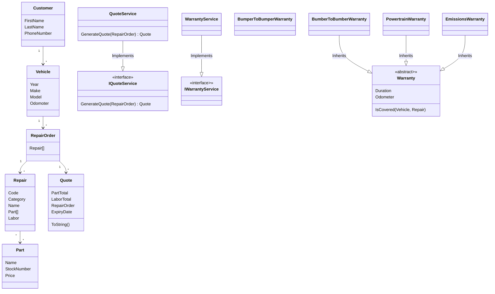

The concept of the project

As a repair shop owner, I would like an automated system to generate quotes for vehicle repair order so that I can provide accurate cost estimates for my customers.

```mermaid
classDiagram
    class Customer {
        FirstName
        LastName
        PhoneNumber
   }
   Customer "1" --> "*" Vehicle
   
   class Vehicle {
       Year
       Make
       Model
       Odomoter
   }
   Vehicle "1" --> "*" RepairOrder
    
    class RepairOrder {
        Repair[]
    }
    RepairOrder "1" --> "*" Repair
    RepairOrder "1" --> "*" Quote
    
    class Repair {
        Code
        Category
        Name
        Part[]
        Labor
    }
    Repair "*" --> "*" Part
    
    class Part {
        Name
        StockNumber
        Price
    }
    
    class Quote {
        PartTotal
        LaborTotal
        RepairOrder
        ExpiryDate
        ToString()
    }
    
    class IQuoteService {
        <<interface>>
        GenerateQuote(RepairOrder) Quote
    }

    class QuoteService {
        GenerateQuote(RepairOrder) Quote
    }
    QuoteService --|> IQuoteService : Implements
    
    class IWarrantyService {
        <<interface>>>
    }

    class WarrantyService {

    }
    WarrantyService --|> IWarrantyService : Implements
    
    class Warranty {
        <<abstract>>>
        Duration
        Odometer
        IsCovered(Vehicle, Repair)
    }
    
    class BumperToBumperWarranty {
        
    }
    BumberToBumberWarranty --|> Warranty : Inherits

    class PowertrainWarranty {

    }
    PowertrainWarranty --|> Warranty : Inherits

    class EmissionsWarranty {

    }
    EmissionsWarranty --|> Warranty : Inherits
    
```